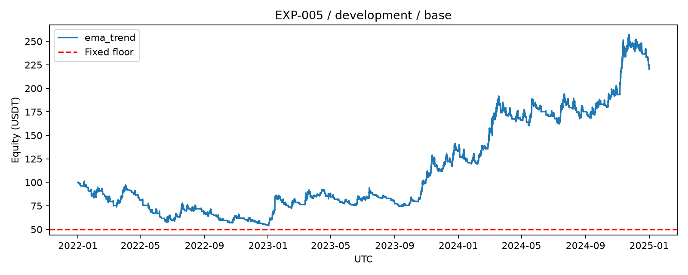

# 两组开发期基准：模型之后要超过什么

2026-10-04（Asia/Shanghai）。已用BTC、ETH、SOL实际小时数据运行2022—2024年历史模拟，手续费和价格不利偏移已计入。两个策略各用独立的100 USDT共同账户。

| 策略 | 期末总资产 | 总收益 | 最大回撤 | 触发50底线 |
| --- | --- | --- | --- | --- |
| 买入持有 EXP-004 | 76.80 USDT | -23.20% | 57.42% | 是 |
| EMA趋势 EXP-005 | 220.40 USDT | +120.40% | 46.66% | 否 |

总收益是三年合计。最大回撤表示从此前净值最高点到之后低点的跌幅。趋势最后赚钱，但2022年仍亏45.51%，过程中曾经历接近一半的回撤；没有证明它适合实盘或能持续复利。固定50底线不随盈利上移，因此与最大回撤不是同一个指标。

买入持有在2022-06-10 17:00 UTC（北京时间次日01:00）净值49.4123时触发底线，停止新买入，首次可行退出后49.3648。SOL当时剩余持仓不足10 USDT最低订单，无法退出，之后仍保留风险与估值，直到终点再次清算；因此期末76.80不代表底线触发后重新开仓。最终仍有1.338605 USDT尾差；趋势最终尾差0.464950，均计入上述总资产。

买入持有只有起点、公共底线和终点交易，无单币止损；趋势按EMA24/72每四小时调仓，使用8%单币止损与4小时冷却。两者暴露不同，不能只看最后收益；每小时开盘平均暴露分别31.51%与45.96%。

| 连续年度分段 | 买入持有 | EMA趋势 |
| --- | --- | --- |
| 2022 | -55.60% | -45.51% |
| 2023 | +37.10% | +144.26% |
| 2024 | +26.16% | +65.59% |

每年沿用上一年账户，没有重新投入100。小本金导致很多差额订单达不到10 USDT门槛：趋势成交1013笔、拒单18033笔，其中11792笔数量取整为零、6237笔金额不足、1笔冷却禁买、3笔无报价。拒单没成交、没扣费用。累计手续费33.6183 USDT，固定参数没有搜索。

129项自动检查及独立代码复查通过。正式输出再逐笔重放6／1013笔成交，核对每组52,610个净值检查点、源码／配置／数据／11个产物的SHA、费用、盈亏、年度连续性及永久禁买，全部通过。证据与明细：

- [买入持有报告](../artifacts/experiments/EXP-004/report.md)、[汇总](../artifacts/experiments/EXP-004/summary.json)、[核对记录](../artifacts/experiments/EXP-004/verification.json)。
- [趋势报告](../artifacts/experiments/EXP-005/report.md)、[汇总](../artifacts/experiments/EXP-005/summary.json)、[核对记录](../artifacts/experiments/EXP-005/verification.json)。
- [代码检查](code-review-2026-10-04-baselines.md)、[实验登记](../EXPERIMENTS.md)、[运行与修改入口](../README.md)。

目前未训练机器学习模型、未评价2025验证或2026保留测试、未跑压力情景或实时模拟、未接入交易账户。当前规则快照近似历史规则，小时线不还原盘口与小时内最大回撤。下一步是模型特征／训练验证实施计划，再比较模型是否改善收益和风险；这两个开发结果只是对照，不是进入实时或实盘的批准。
